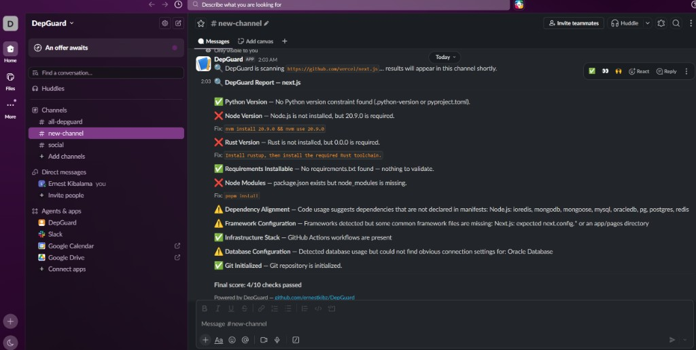

# DepGuard for Slack

Run DepGuard from Slack against public GitHub repositories.

Core engine: https://github.com/ernestkibz/DepGuard

---

## What this does

This repo adds a Slack bot and MCP layer on top of the DepGuard scan engine.

Typical flow:

1. You run `/depguard https://github.com/owner/repo` in Slack.
2. The bot clones the public repo into a temporary folder.
3. DepGuard detects the stack and runs relevant checks.
4. Results are posted back to Slack with suggestions and fix commands where available.

---

## What you can type

```text
/depguard https://github.com/owner/repo
/depguard github.com/owner/repo
/depguard owner/repo
```

The word `scan` is only a usage hint — you still need a repo URL or `owner/repo`.

---

## How to read the report

| Status | Meaning |
|--------|---------|
| **PASS** | Enough evidence the setup looks correct |
| **FAIL** | Concrete problem or unmet requirement |
| **WARN** | Signal worth review — not always a confirmed production issue |

Each non-pass check may include:

- **Suggestion** — safest next step in plain language
- **Fix** — copy-paste command when one exists

### Grey-area warnings

- Dependencies may appear used from imports but belong to tests, examples, or optional adapters
- Database signals may suggest Oracle-related usage without proving active Oracle production use
- Framework markers may be missing in monorepos or custom layouts

---

## Example output

```text
[REPORT] DepGuard Report — next.js

[WARN] Database Configuration — DepGuard found database-related dependencies or code signals, but could not confirm common connection markers for: Oracle Database.
       Suggestion: Verify the real runtime database from environment variables, secrets management, deployment config, or connection factory code before treating this as a confirmed production dependency.

[FAIL] Node Modules — package.json exists but node_modules is missing.
       Suggestion: Run the repository's package manager from the project root, let it restore dependencies from the lockfile, and then rerun the app build or tests.
       Fix: npm install

Final score: 0/2 checks passed
Note: Some warnings are signal-based and may reflect optional adapters, examples/tests, custom layouts, or environment-managed config.
```

---

## Screenshot

DepGuard report posted in Slack after scanning a public GitHub repository:



---

## What you need

- A Slack workspace with the app installed
- A running backend for this repo (local or Railway)
- A public GitHub repository URL to scan

For install, Slack app setup, and deployment steps, see [setup.md](setup.md).

---

## License

MIT.
